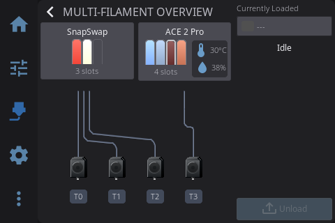
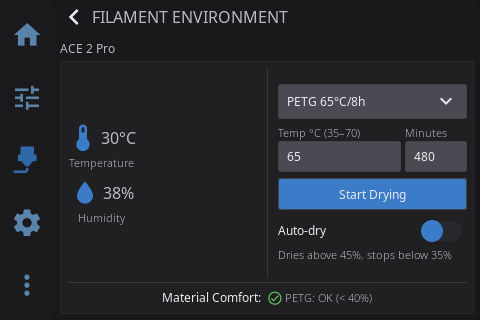
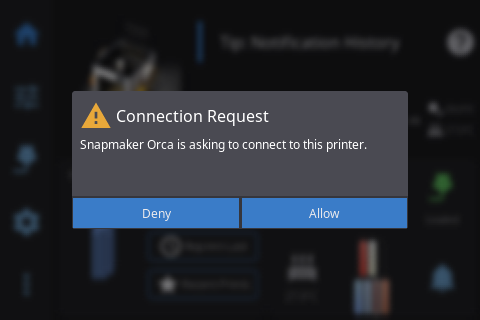

<p align="center">
  
  <br>
  <h1 align="center">HelixScreen for the Snapmaker U1</h1>
  <p align="center"><strong>A fork of HelixScreen that supports the U1's toolchanger and multiple ACE units</strong></p>
</p>

<p align="center">
  <a href="https://github.com/physicsG/helixscreen/actions/workflows/snapmaker-u1.yml"></a>
  <a href="https://github.com/physicsG/helixscreen/releases"></a>
  <a href="https://www.gnu.org/licenses/gpl-3.0"></a>
</p>

> **This is a fork of [prestonbrown/helixscreen](https://github.com/prestonbrown/helixscreen).**
> Everything upstream HelixScreen does, this does — see [upstream's README](https://github.com/prestonbrown/helixscreen#readme)
> for the full feature tour. What follows is only what this fork adds on top, for
> the Snapmaker U1.
>
> Upstream is merged in regularly, and U1 work goes back upstream where it fits.

---

## What this fork adds

### Multiple ACE units alongside the U1's own toolheads

Stock HelixScreen models the U1 as a four-head parallel toolchanger. This fork adds
**multiACE**: one or more Snapmaker ACE units feeding the same machine, shown as
separate units with their own slot counts, and a filament path that traces which
spool actually feeds which tool.



Per-unit drying comes with it — live temperature and humidity, material presets, and
auto-dry with its own thresholds:



### LAN pairing for Snapmaker Orca and the Snapmaker App

The U1's firmware brokers pairing itself and delegates one step to the printer's
screen: the approval tap. Replacing the stock screen means nothing answers, so
Orca and the phone app hang at *"requesting connection"* until they time out.

This fork answers it:



Deny goes on the wire too, so a refused client fails immediately instead of waiting.
Details in [`docs/devel/LAN_CLIENT_AUTHORIZATION.md`](docs/devel/LAN_CLIENT_AUTHORIZATION.md).

### Installable U1 builds

Upstream's release pipeline needs secrets a fork does not have. This fork ships its
own U1 workflow that cross-compiles, packages and publishes a working build from a
`u1-v*` tag — plus a fork-aware installer, so the printer is offered *this* repo's
releases as updates rather than upstream's.

---

## Install

On the printer, over SSH:

```sh
curl -fsSL https://github.com/physicsG/helixscreen/releases/latest/download/install-fork.sh | sh
```

That is a thin front-end for upstream's installer — platform detection, service
setup, backup/rollback and SHA256 verification are all the same code path. It only
pins the repo to this fork and skips upstream's CDN, which would otherwise serve
upstream's binary.

```sh
sh install-fork.sh --update                  # update in place
sh install-fork.sh --version u1-v0.99.116    # pin a specific build
sh install-fork.sh --local helixscreen-snapmaker-u1.zip   # from a downloaded archive
```

SSH on the U1: `Settings > Maintenance > Root Access`, or the `firmware-config` web
page. Credentials are `root` / `snapmaker`.

---

## Branches

| Branch | What it is |
|---|---|
| `develop/snapmaker-multiace` | **Default.** The U1 + multiACE work. Releases are cut from here |
| `main` | A clean mirror of upstream `main` — never committed to directly, so upstream merges stay conflict-free |

Release tags are `u1-v<version>` (e.g. `u1-v0.99.116`), deliberately not `v*`:
upstream's tag would start a release pipeline this fork cannot complete.

---

## Everything else

Features, supported printers, configuration, the user guide and troubleshooting are
all upstream's and unchanged — start at
**[upstream's README](https://github.com/prestonbrown/helixscreen#readme)** and the
[User Guide](docs/user/USER_GUIDE.md).

Bugs in U1 or multiACE behaviour belong [here](https://github.com/physicsG/helixscreen/issues).
Anything that reproduces without a U1 is better reported
[upstream](https://github.com/prestonbrown/helixscreen/issues).
